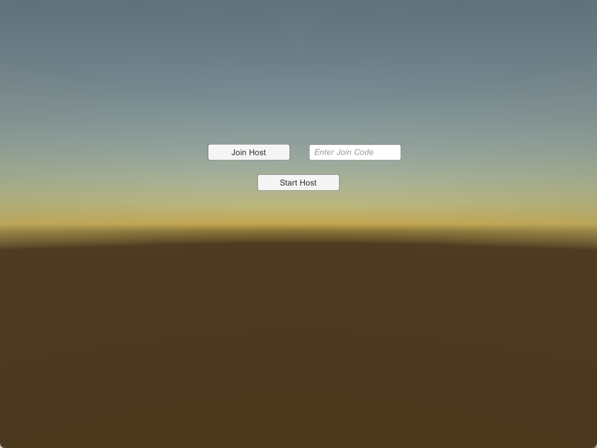

# ViewParty

  A social game where you can share videos with 
your friends as if you were hanging out! 
ViewParty is inspired by the likes of [Garry's Mod Cinema](https://www.youtube.com/watch?v=gceedIPSAjc) 
and virtual concerts, which both incorporate online, 
interactive solutions for entertainment and sociable 
environments in a remote environment. 

# Images

The starting screen:

What the host view looks like, containing
commands for video control:

Multiplayer demonstration:

# How to play

For Windows, all you need is the `ViewPartyGame.zip` 
file, which when extracted contains the contents
needed to play the game.

Builds for other platforms has yet to be released.
